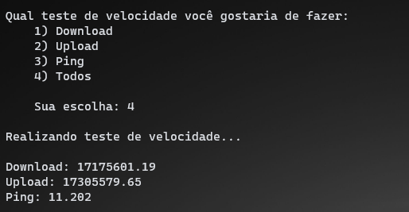

## NetSpeedTest (Teste de velocidade da internet)


### :snake: O Projeto
Script feito em python que realiza um teste de velocidade da internet utilizando a Lib speedtest_cli.

### :clipboard: Dependências
* Pip
* Biblioteca speedtest_cli

### :rocket: Como instalar as dependências
```
pip install speedtest_cli
```

### :camera: Imagem do projeto
 <br>

**Desenvolvedor:** Everton Reis